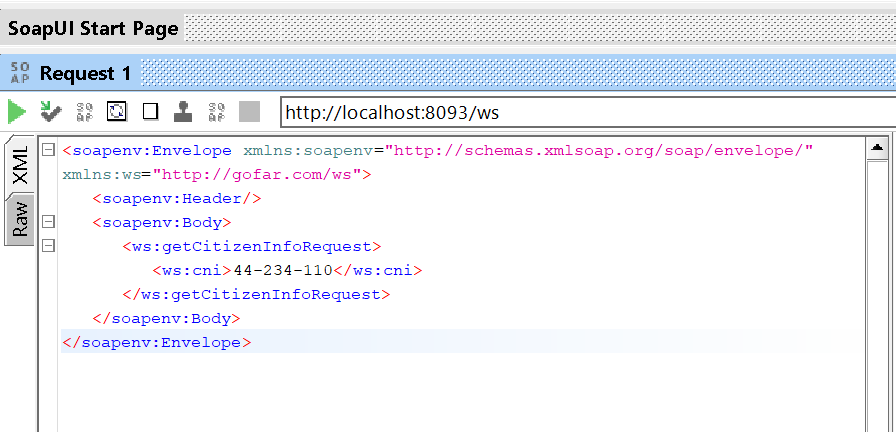
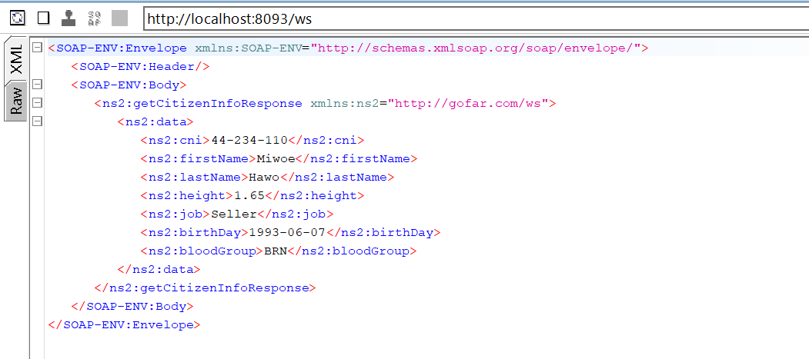

# CITZENS WS

## Description
This project named ``citzens`` is soap based web service that is used
to handle requests about citizens of some country.

## Features

- Expose an endpoint for serving citizens' data retrieval from soap clients

## Usage

1. ### Clone the project
    ````text
    git clone https://github.com/Tountoun/citzens-ws.git
    ````
2. ### Open the project folder with your favourite IDE

3. ### Install dependencies by running `mvn clean install`

4. ### Run the project

## Generated WSDL

````xml
<wsdl:definitions xmlns:wsdl="http://schemas.xmlsoap.org/wsdl/" xmlns:sch="http://gofar.com/ws" xmlns:soap="http://schemas.xmlsoap.org/wsdl/soap/" xmlns:tns="http://gofar.com/ws" targetNamespace="http://gofar.com/ws">
<wsdl:types>
<xs:schema xmlns:xs="http://www.w3.org/2001/XMLSchema" elementFormDefault="qualified" targetNamespace="http://gofar.com/ws">
<xs:element name="getCitizenInfoRequest">
<xs:complexType>
<xs:sequence>
<xs:element name="cni" type="xs:string"/>
</xs:sequence>
</xs:complexType>
</xs:element>
<xs:element name="getCitizenInfoResponse">
<xs:complexType>
<xs:sequence>
<xs:element name="data" type="tns:citizen"/>
</xs:sequence>
</xs:complexType>
</xs:element>
<xs:simpleType name="bloodGroup">
<xs:restriction base="xs:string">
<xs:enumeration value="ARP"/>
<xs:enumeration value="BRP"/>
<xs:enumeration value="ORP"/>
<xs:enumeration value="ABRP"/>
<xs:enumeration value="ARN"/>
<xs:enumeration value="BRN"/>
<xs:enumeration value="ORN"/>
<xs:enumeration value="ABRN"/>
</xs:restriction>
</xs:simpleType>
<xs:complexType name="citizen">
<xs:sequence>
<xs:element name="cni" type="xs:string"/>
<xs:element name="firstName" type="xs:string"/>
<xs:element name="lastName" type="xs:string"/>
<xs:element name="motherName" type="xs:string"/>
<xs:element name="fatherName" type="xs:string"/>
<xs:element name="height" type="xs:double"/>
<xs:element name="job" type="xs:string"/>
<xs:element name="birthDay" type="xs:date"/>
<xs:element name="bloodGroup" type="tns:bloodGroup"/>
</xs:sequence>
</xs:complexType>
</xs:schema>
</wsdl:types>
<wsdl:message name="getCitizenInfoResponse">
<wsdl:part element="tns:getCitizenInfoResponse" name="getCitizenInfoResponse"> </wsdl:part>
</wsdl:message>
<wsdl:message name="getCitizenInfoRequest">
<wsdl:part element="tns:getCitizenInfoRequest" name="getCitizenInfoRequest"> </wsdl:part>
</wsdl:message>
<wsdl:portType name="CitizenServicePort">
<wsdl:operation name="getCitizenInfo">
<wsdl:input message="tns:getCitizenInfoRequest" name="getCitizenInfoRequest"> </wsdl:input>
<wsdl:output message="tns:getCitizenInfoResponse" name="getCitizenInfoResponse"> </wsdl:output>
</wsdl:operation>
</wsdl:portType>
<wsdl:binding name="CitizenServicePortSoap11" type="tns:CitizenServicePort">
<soap:binding style="document" transport="http://schemas.xmlsoap.org/soap/http"/>
<wsdl:operation name="getCitizenInfo">
<soap:operation soapAction=""/>
<wsdl:input name="getCitizenInfoRequest">
<soap:body use="literal"/>
</wsdl:input>
<wsdl:output name="getCitizenInfoResponse">
<soap:body use="literal"/>
</wsdl:output>
</wsdl:operation>
</wsdl:binding>
<wsdl:service name="CitizenServicePortService">
<wsdl:port binding="tns:CitizenServicePortSoap11" name="CitizenServicePortSoap11">
<soap:address location="http://localhost:8093/ws"/>
</wsdl:port>
</wsdl:service>
</wsdl:definitions>
````

## Tests
For testing, you can use [soap ui](https://www.soapui.org/tools/soapui/)

- Request



- Response




## Contact
- Feel free to join me at [tountounabela@gmail.com](mailto://tountounabela@gmail.com)